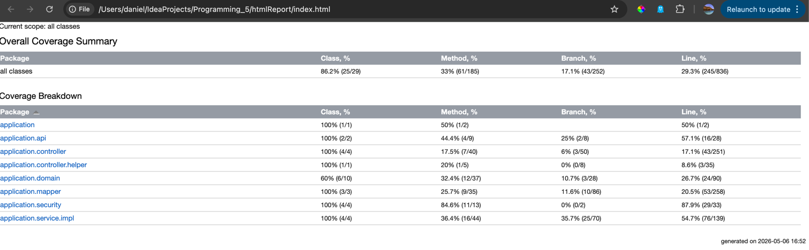

# Programming 5 - Formula 1 Management System

## Student Information

- **Course:** Programming 5
- **Name:** Daniel Nedyalkov
- **Email:** daniel.nedyalkov@student.kdg.be
- **Student ID:** 0172599-36
- **Academic Year:** 2025-2026
- **Group:** ACS201

---

## Domain Entities

This is a **Formula 1 Management System** with the following entities:

### 1. Driver

- **Properties:** id, name, dateOfBirth, nationality, worldChampionships, imageUrl
- **Relationships:** ManyToOne with Team, ManyToMany with Race

### 2. Team

- **Properties:** id, name, foundedYear, league (enum), teamLogoUrl, budgetInMillions
- **Relationships:** OneToMany with Driver

### 3. Race

- **Properties:** id, name, date, hasEnded
- **Relationships:** ManyToOne with Track, ManyToOne with Driver (winner), ManyToMany with Driver

### 4. Track (Base class with inheritance)

- **Properties:** id, name, location, lengthKm, openedYear
- **Inheritance Strategy:** Single Table
- **Subtypes:**
  - **PermanentCircuit:** hasMuseum, testDaysPerYear, facilities
  - **StreetCircuit:** cityName, daysToSetup, annualRentalCost, hasTemporaryBarriers

### 5. League (Enum)

- **Values:** Formula_1, Formula_2, Formula_3, Formula_4, Formula_E

### Entity Relationships Diagram

```
Team (1) ----< (many) Driver
Driver (many) >----< (many) Race
Track (1) ----< (many) Race
Race (many) >---- (1) Driver (as winner)

Track (Single Table Inheritance)
  ├── PermanentCircuit
  └── StreetCircuit
```

---

## Build and Run Instructions

### Prerequisites

- Java 21 or higher
- Docker and Docker Compose
- Git
- Node.js and npm

### Setup Steps

1. **Clone the repository:**
   ```bash
   git clone https://gitlab.com/kdg-ti/programming-5/projects-25-26/acs201/daniel.nedyalkov/spring-backend.git
   cd spring-backend
   ```

2. **Start the development PostgreSQL database using Docker:**
   ```bash
   docker compose up -d
   ```
   This starts the `f1Management` PostgreSQL database on host port `5050`.
   The default Spring configuration loads `src/main/resources/sql/data.sql`.

3. **Build the application:**
   ```bash
   ./gradlew build
   ```

4. **Run the application:**
   ```bash
   ./gradlew bootRun
   ```

5. **Access the application:**
   - Open your browser: `http://localhost:8080`

### Embedded Frontend Build

Week 11 adds an embedded npm/webpack frontend build to this Spring Boot project.

Frontend source files:

- JavaScript: `src/main/js`
- SCSS: `src/main/scss`
- Generated Spring static assets: `src/main/resources/static/js` and `src/main/resources/static/css`

Install npm dependencies:

```bash
npm install
```

Build the embedded frontend manually:

```bash
npm run build
```

Run frontend checks:

```bash
npm run lint
npm run check
```

Format frontend files:

```bash
npm run fmt
```

Gradle integration:

- `processResources` depends on `npm_run_build`.
- Running `./gradlew build`, `./gradlew bootRun`, or `./gradlew processResources` builds the frontend bundles before Spring serves the static assets.
- On macOS, `build.gradle.kts` contains a Homebrew npm command fix for `/opt/homebrew/bin/npm`.

### Separate Client Project

Week 10 adds a separate frontend Client project. The Spring Boot backend must run on `http://localhost:8080`, and the Client webpack dev server runs on `http://localhost:9000`.

The Client provides a small single-page interface with two views:

- **Search:** searches drivers by nationality.
- **Add:** adds a new team through the backend REST API.

Backend endpoints used by the Client:

```text
GET /api/drivers/search?nationality=...
POST /api/teams
```

Security configuration for the Client:

- `GET /api/drivers/search` is public so the Client can search drivers.
- `POST /api/teams` is public only so the separate Client project can test adding teams without logging in.
- CSRF is disabled only for `POST /api/teams`.
- CORS allows only the Client origin: `http://localhost:9000`.

Run the Client:

```bash
cd /Users/daniel/IdeaProjects/Client
npm install
npm run start
```

Then open `http://localhost:9000` in the browser. Keep the Spring Boot backend running at the same time, because the Client sends requests to `http://localhost:8080`.

Useful Client checks:

```bash
cd /Users/daniel/IdeaProjects/Client
npm run lint
npm run format:check
npm run build
```

### Spring Profiles and Testing

- The default profile uses `src/main/resources/application.properties` and loads the normal seed data from `classpath:sql/data.sql`.
- Tests use the `test` profile through `@ActiveProfiles("test")`.
- The `test` profile is configured in `src/test/resources/application-test.properties`.
- Test data seeding is disabled with `spring.sql.init.mode=never`, so tests arrange their own data and do not depend on development seed data.
- Tests use a separate PostgreSQL database, `f1Management-test`, on host port `5435`.

Start the test database:

```bash
docker compose -f docker-compose.test.yml up -d
```

Run the test suite:

```bash
./gradlew test
```

The tests are configured with `@ActiveProfiles("test")`, so the single command above runs the full test suite against the test-specific PostgreSQL database.

Presentation-layer integration test classes:

- MVC integration tests: `DriverControllerTest`, `TeamControllerTest`
- API integration tests: `ApiDriverControllerTest`
- Role verification tests: `ApiDriverControllerTest`

Code coverage screenshot from IntelliJ:



Unit tests with mocking:

- Mocking tests: `ApiDriverControllerUnitTest`, `DriverServiceUnitTest`
- `verify` tests: `ApiDriverControllerUnitTest`, `DriverServiceUnitTest`

Continuous integration:

- The GitLab CI pipeline is configured in `.gitlab-ci.yml`.
- The pipeline runs automatically when changes are pushed to GitLab.
- The pipeline has two stages: `build` and `test`.
- The `build` job runs `./gradlew --build-cache assemble`.
- The `test` job runs `./gradlew test`.
- The `test` job starts a PostgreSQL service and sets `CI_DB_HOST_PORT=postgres:5432`, so Spring tests connect to the CI database service.
- Locally, the same tests still use the Docker Compose test database through the fallback `localhost:5435` value in `application-test.properties`.
- The test job publishes a JUnit report from `build/test-results/test/**/TEST-*.xml`.

GitLab test report:

- [Recent successful GitLab test report](https://gitlab.com/kdg-ti/programming-5/projects-25-26/acs201/daniel.nedyalkov/spring-backend/-/pipelines/2505132563/test_report)

Stop the test database:

```bash
docker compose -f docker-compose.test.yml down
```

### Stopping the Application

- **Stop Spring Boot:** Press `Ctrl+C` in the terminal
- **Stop PostgreSQL:**
  ```bash
  docker compose down
  ```

### Useful Commands

```bash
# Clean and rebuild
./gradlew clean build

# Start the development database
docker compose up -d

# Start the test database
docker compose -f docker-compose.test.yml up -d

# Run tests with the test profile
./gradlew test

# Check Docker containers status
docker compose ps

# View database logs
docker compose logs postgres_boardgames_db

# Access PostgreSQL CLI
docker compose exec postgres_boardgames_db psql -U spring -d f1Management
```

---

## Technology Stack

- **Framework:** Spring Boot 3.5.6
- **Java:** 21
- **Database:** PostgreSQL (Docker)
- **ORM:** Spring Data JPA / Hibernate
- **Template Engine:** Thymeleaf
- **CSS Framework:** Bootstrap 5.3.3
- **Build Tool:** Gradle (Kotlin DSL)

---

## Project Structure

```
src/main/java/application/
├── domain/              # Entity classes (Driver, Team, Race, Track, etc.)
├── repository/JPA/      # Spring Data JPA Repository interfaces
├── service/             # Service layer with business logic
├── controller/          # Spring MVC controllers
└── viewmodel/           # View model classes for data transfer

src/main/resources/
├── templates/           # Thymeleaf HTML templates
├── static/              # Static assets (CSS, JS, images)
├── sql/data.sql         # Development seed data
└── application.properties

src/test/resources/
└── application-test.properties # Test profile datasource configuration

docker-compose.yml       # Development PostgreSQL database configuration
docker-compose.test.yml  # Test PostgreSQL database configuration
```

---

## Week 2

This section contains HTTP requests and responses for the REST API endpoints implemented for drivers.

### Fetching all drivers - OK (200)

**Request:**

```
GET http://localhost:8080/api/drivers
Accept: application/json
```

**Response:**

```
HTTP/1.1 200
Content-Type: application/json

[
  {
    "id": 5,
    "name": "Nikola Tsolov",
    "dateOfBirth": "2006-12-21",
    "nationality": "Bulgarian",
    "worldChampionships": 0,
    "teamId": 4,
    "teamName": "Levski",
    "imageUrl": "/img/Nikola.png"
  },
  {
    "id": 4,
    "name": "Carlos Sainz",
    "dateOfBirth": "1994-09-01",
    "nationality": "Spanish",
    "worldChampionships": 0,
    "teamId": 2,
    "teamName": "Ferrari",
    "imageUrl": "/img/Carlos.png"
  },
  {
    "id": 3,
    "name": "Charles Leclerc",
    "dateOfBirth": "1997-10-16",
    "nationality": "Monegasque",
    "worldChampionships": 0,
    "teamId": 2,
    "teamName": "Ferrari",
    "imageUrl": "/img/Leclerc.png"
  },
  {
    "id": 2,
    "name": "Max Verstappen",
    "dateOfBirth": "1997-09-30",
    "nationality": "Dutch",
    "worldChampionships": 2,
    "teamId": 3,
    "teamName": "Red Bull Racing",
    "imageUrl": "/img/Verstappen.png"
  },
  {
    "id": 1,
    "name": "Lewis Hamilton",
    "dateOfBirth": "1985-01-07",
    "nationality": "British",
    "worldChampionships": 7,
    "teamId": 1,
    "teamName": "Mercedes",
    "imageUrl": "/img/Hamilton.png"
  }
]
```

---

### Fetching single driver by ID - OK (200)

**Request:**

```
GET http://localhost:8080/api/drivers/1
Accept: application/json
```

**Response:**

```
HTTP/1.1 200
Content-Type: application/json

{
  "id": 1,
  "name": "Lewis Hamilton",
  "dateOfBirth": "1985-01-07",
  "nationality": "British",
  "worldChampionships": 7,
  "teamId": 1,
  "teamName": "Mercedes",
  "imageUrl": "/img/Hamilton.png"
}
```

---

### Fetching single driver by ID - Not Found (404)

**Request:**

```
GET http://localhost:8080/api/drivers/999
Accept: application/json
```

**Response:**

```
HTTP/1.1 404
Content-Length: 0
```

---

### Fetching races for a specific driver - OK (200)

**Request:**

```
GET http://localhost:8080/api/drivers/1/races
Accept: application/json
```

**Response:**

```
HTTP/1.1 200
Content-Type: application/json

[
  {
    "id": 1,
    "name": "Monaco Grand Prix",
    "date": "2025-05-25",
    "trackId": 1,
    "trackName": "Monaco GP",
    "winnerId": 1,
    "winnerName": "Lewis Hamilton",
    "hasEnded": true
  },
  {
    "id": 2,
    "name": "British Grand Prix",
    "date": "2025-07-13",
    "trackId": 2,
    "trackName": "Silverstone",
    "winnerId": 2,
    "winnerName": "Max Verstappen",
    "hasEnded": true
  }
]
```

---

### Fetching races for a specific driver - Not Found (404)

**Request:**

```
GET http://localhost:8080/api/drivers/999/races
Accept: application/json
```

**Response:**

```
HTTP/1.1 404
Content-Length: 0
```

---

### Deleting a driver - No Content (204)

**Request:**

```
DELETE http://localhost:8080/api/drivers/5
```

**Response:**

```
HTTP/1.1 204
```

---

### Deleting a driver - Not Found (404)

**Request:**

```
DELETE http://localhost:8080/api/drivers/999
```

**Response:**

```
HTTP/1.1 404
Content-Length: 0
```

---

## Week 3

### Creating a driver - Created (201)

**Request:**

```http
POST http://localhost:8080/api/drivers
Accept: application/json
Content-Type: application/json

{
  "name": "Lando Norris",
  "dateOfBirth": "1999-11-13",
  "nationality": "British",
  "worldChampionships": 0,
  "imageUrl": "/img/Lando.png"
}
```

**Response:**

```http
HTTP/1.1 201
Content-Type: application/json

{
  "id": 6,
  "name": "Lando Norris",
  "dateOfBirth": "1999-11-13",
  "nationality": "British",
  "worldChampionships": 0,
  "imageUrl": "/img/Lando.png"
}
```

### Creating a driver - Bad Request (400)

**Request:**

```http
POST http://localhost:8080/api/drivers
Accept: application/json
Content-Type: application/json

{
  "name": "A",
  "dateOfBirth": "2099-01-01",
  "nationality": "B",
  "worldChampionships": 99,
  "imageUrl": ""
}
```

**Response:**

```http
HTTP/1.1 400
Content-Type: application/json
```

### Updating a driver with PATCH - OK (200)

**Request:**

```http
PATCH http://localhost:8080/api/drivers/5
Accept: application/json
Content-Type: application/json

{
  "worldChampionships": 3
}
```

**Response:**

```http
HTTP/1.1 200
Content-Type: application/json

{
  "id": 5,
  "name": "Nikola Tsolov",
  "dateOfBirth": "2006-12-21",
  "nationality": "Bulgarian",
  "worldChampionships": 3,
  "imageUrl": "/img/Nikola.png"
}
```

### Updating a driver with PATCH - Bad Request (400)

**Request:**

```http
PATCH http://localhost:8080/api/drivers/5
Accept: application/json
Content-Type: application/json

{
  "worldChampionships": 11
}
```

**Response:**

```http
HTTP/1.1 400
Content-Type: application/json
```

### Updating a driver with PATCH - Not Found (404)

**Request:**

```http
PATCH http://localhost:8080/api/drivers/999
Accept: application/json
Content-Type: application/json

{
  "worldChampionships": 1
}
```

**Response:**

```http
HTTP/1.1 404
Content-Length: 0
```

### Deleting a driver - No Content (204)

**Request:**

```http
DELETE http://localhost:8080/api/drivers/1
Accept: application/json
```

**Response:**

```http
HTTP/1.1 204
```

### Deleting a driver - Not Found (404)

**Request:**

```http
DELETE http://localhost:8080/api/drivers/999
Accept: application/json
```

**Response:**

```http
HTTP/1.1 404
Content-Length: 0
```

---

## Week 4

### Spring Security and authentication

Spring Security is enabled with a persisted `AppUser` entity, a custom login page, logout support, and BCrypt-hashed passwords in the database.

The application seeds these users:

| Username | Password | Notes                     |
| -------- | -------- | ------------------------- |
| `Daniel` | `Dani`   | Seeded administrator user |
| `Ivan`   | `Ivan`   | Seeded normal user        |
| `Viki`   | `Viki`   | Seeded normal user        |

The login page also displays these dummy credentials for testing:

- [Login page](http://localhost:8080/login)

### Public and protected pages

- Public page: [All Drivers](http://localhost:8080/drivers)
- Public driver details example: [Driver 1](http://localhost:8080/drivers/1)
- Authentication required page: [All Teams](http://localhost:8080/teams)

Authenticated users can see application-specific actions that anonymous users cannot see, such as the ability to add or manage drivers. The username is shown in the navbar after login.

CSRF was temporarily disabled when Spring Security was first introduced for Week 4. It is enabled again in the Week 5 implementation.

---

## Week 5

### Seeded users

The application seeds three persisted users in the `app_users` table. Passwords are stored as BCrypt hashes in the database, but the following credentials can be used to log in:

| Username | Password | Role    | Managed team    |
| -------- | -------- | ------- | --------------- |
| `Daniel` | `Dani`   | `ADMIN` | Mercedes        |
| `Ivan`   | `Ivan`   | `USER`  | Ferrari         |
| `Viki`   | `Viki`   | `USER`  | Red Bull Racing |

### Roles and access rights

The application distinguishes between three access categories: unauthenticated visitors, signed-in `USER`s, and signed-in `ADMIN`s.

| Category             | Can access                                                                                        | Can create                   | Can update/delete                                                    | Notes                                                                              |
| -------------------- | ------------------------------------------------------------------------------------------------- | ---------------------------- | -------------------------------------------------------------------- | ---------------------------------------------------------------------------------- |
| Unauthenticated user | Public driver pages such as [All Drivers](http://localhost:8080/drivers) and the home page        | No                           | No                                                                   | Hidden from add/edit/delete actions and redirected to `/login` for protected pages |
| `USER`               | Public pages plus protected pages after login, including [All Teams](http://localhost:8080/teams) | Can create drivers           | Can update/delete only drivers associated with the same managed team | Cannot manage teams                                                                |
| `ADMIN`              | All pages                                                                                         | Can create drivers and teams | Can update/delete any driver and can manage teams                    | Can also assign or reassign driver teams                                           |

### Hidden UI elements

The UI hides actions that the current visitor cannot perform:

- On [All Drivers](http://localhost:8080/drivers), unauthenticated visitors do not see the inline add-driver form or the edit/delete buttons on driver cards.
- On [All Teams](http://localhost:8080/teams), non-admin users do not see the add-team button or the delete-team action.
- In the navbar, admin-only quick actions such as `Add Team` are hidden from non-admin users.

The backend also verifies these restrictions. Hidden controls are only a convenience layer; controller and service logic still enforce the same access rules.

### User-to-entity relationship

The persisted user entity is `AppUser`. It is associated with `Team` through the `managerInTeam` relation.

- A signed-in user who creates a new driver creates it for their managed team.
- Drivers are therefore associated to users indirectly through the team they belong to.
- A normal `USER` may update or delete only drivers belonging to their own managed team.
- An `ADMIN` may update or delete any driver.
- Users without a managed team cannot manage drivers.

This can be observed on:

- [All Drivers](http://localhost:8080/drivers)
- [Driver Details Example](http://localhost:8080/drivers/1)
- [All Teams](http://localhost:8080/teams)

### Authentication and CSRF

- Custom login page: `/login`
- Logout endpoint/form: `/logout`
- Logged-in username is shown in the navbar with `sec:authentication="name"`.
- CSRF protection is enabled.
- Thymeleaf exposes the CSRF token and header name through meta tags in the page header.
- AJAX requests include the CSRF header when calling the REST API, so the API and Ajax flows keep working with CSRF enabled.

### Verification links

- Public page: [All Drivers](http://localhost:8080/drivers)
- Public driver details example: [Driver 1](http://localhost:8080/drivers/1)
- Authentication required page: [All Teams](http://localhost:8080/teams)
- Login page: [Login](http://localhost:8080/login)

---

## Week 6

### Spring profiles and test database

Tests use a separate Spring profile and a separate PostgreSQL database so test data does not interfere with development seed data.

- Test profile: `test`
- Test configuration: `src/test/resources/application-test.properties`
- Development seed data: `src/main/resources/sql/data.sql`
- Test seeding: arranged inside tests with `TestHelper`, `@BeforeEach`, and test-specific setup
- Test database: `f1Management-test`
- Test database Docker Compose file: `docker-compose.test.yml`

Start the test database:

```bash
docker compose -f docker-compose.test.yml up -d
```

Run all tests:

```bash
./gradlew test
```

### Repository integration tests

Repository tests are in:

- `RaceRepositoryTest`
- `AppUserRepositoryTest`

Covered behavior:

- `RaceRepositoryTest.deletingRaceDeletesRaceDrivers` verifies delete behavior for associated `RaceDriver` records.
- `RaceRepositoryTest.findByIdFetchesRaceDetails` verifies fetching mapped race details.
- `RaceRepositoryTest.findRacesByDriverIdReturnsOnlyRacesForThatDriver` verifies query behavior.
- `AppUserRepositoryTest.duplicateUsernamesIsNotAllowed` verifies the username uniqueness mapping.

### Service integration tests

Service integration tests are in:

- `DriverServiceTest`
- `RaceServiceTest`

Covered behavior:

- `DriverServiceTest` verifies successful driver update by the manager of the driver's team and forbidden update by another manager.
- `RaceServiceTest` verifies updating race details, winner, and driver selection data.

---

## Week 8

### Presentation-layer integration tests

All presentation-layer tests run with Spring Security enabled and use MockMVC.

Run all tests:

```bash
./gradlew test
```

MVC integration test classes:

- `DriverControllerTest`
- `TeamControllerTest`

API integration test classes:

- `ApiDriverControllerTest`

Role verification test class:

- `ApiDriverControllerTest`

### Authorization tests

The authorization requirement is tested on controller endpoints that receive the authenticated user through `@AuthenticationPrincipal`.

`ApiDriverControllerTest` verifies:

- A manager can patch a driver from the manager's own team.
- A manager cannot patch a driver from another team.
- An admin can patch a driver from any team and can change the driver's team.
- A manager can delete a driver from the manager's own team.
- A manager cannot delete a driver from another team.
- An admin can delete a driver from any team.

### Code coverage

Code coverage screenshot from IntelliJ:


---

## Week 9

### Unit tests with mocking

Mocking tests are in:

- `ApiDriverControllerUnitTest`
- `DriverServiceUnitTest`

`ApiDriverControllerUnitTest` tests the `POST /api/drivers` controller method with mocked controller dependencies:

- `IDriverService`
- `DriverMapper`

`DriverServiceUnitTest` tests driver update and delete service logic with mocked repositories:

- `IDriverRepository`
- `IAppUserRepository`
- `ITeamRepository`
- `IDriverRaceRepository`

### Verify tests

Tests using Mockito `verify` are in:

- `ApiDriverControllerUnitTest`
- `DriverServiceUnitTest`

Examples:

- `ApiDriverControllerUnitTest.addDriverReturnsCreated` verifies that the controller calls the mapper and service with the expected objects.
- `DriverServiceUnitTest.managerCanUpdateDriverFromManagedTeam` verifies that `driverRepository.save(driver)` is called.
- `DriverServiceUnitTest.managerCannotUpdateDriverFromDifferentTeam` verifies that `driverRepository.save(driver)` is not called.
- `DriverServiceUnitTest.managerCanDeleteDriverFromManagedTeam` verifies that `driverRepository.deleteById(driver.getId())` is called.

### Continuous integration

The GitLab CI pipeline is configured in `.gitlab-ci.yml`.

- The pipeline triggers automatically when changes are pushed.
- Stages: `build`, `test`
- Build job: `./gradlew --build-cache assemble`
- Test job: `./gradlew test`
- CI database service: `postgres:18-alpine`
- CI database name: `f1Management-test`
- CI connection host: `postgres:5432`
- Local test database fallback: `localhost:5435`
- JUnit test report artifact: `build/test-results/test/**/TEST-*.xml`

GitLab test report:

- [Recent successful GitLab test report](https://gitlab.com/kdg-ti/programming-5/projects-25-26/acs201/daniel.nedyalkov/spring-backend/-/pipelines/2505132563/test_report)

---

## Week 10

### Separate Client project

Week 10 uses a separate Client repository for the frontend code. Java backend changes remain in this Spring Boot repository.

Client repository:

```bash
git clone git@gitlab.com:kdg-ti/programming-5/projects-25-26/acs201/daniel.nedyalkov/Client.git
cd Client
npm install
npm run start
```

The backend must also be running:

```bash
./gradlew bootRun
```

Open the Client at:

```text
http://localhost:9000
```

The Client uses npm, webpack, ESLint, dprint, Sass, and Bootstrap. It contains one HTML page with SPA-style navigation between `Search` and `Add` sections using custom JavaScript.

Useful Client checks:

```bash
npm run lint
npm run format:check
npm run build
```

### Backend API endpoints for the Client

Search endpoint:

```http
GET http://localhost:8080/api/drivers/search?nationality=Bul
Accept: application/json
```

This endpoint searches drivers by nationality and is public so the separate Client project can use it.

Add endpoint:

```http
POST http://localhost:8080/api/teams
Accept: application/json
Content-Type: application/json

{
  "name": "McLaren",
  "foundedYear": 1963,
  "league": "Formula_1",
  "teamLogoUrl": "https://example.com/mclaren.png",
  "budgetInMillions": 25.0
}
```

This endpoint creates a team and is public only for testing the separate Client project.

### CORS and CSRF for the Client

Security configuration for Week 10:

- CORS allows only the Client origin: `http://localhost:9000`.
- `GET /api/drivers/search` is public.
- `POST /api/teams` is public only for the separate Client project.
- CSRF is disabled only for `POST /api/teams`.
- Comments in `SecurityConfig` explain both the `permitAll` rule and the CSRF exception for the Client assignment.

---

## Week 11

### Embedded npm and webpack frontend

Week 11 uses an embedded frontend build inside this Spring Boot repository.

The frontend build is configured with:

- npm and `package.json`
- webpack and `webpack.config.js`
- ESLint and `eslint.config.js`
- dprint and `dprint.json`
- Sass/SCSS in `src/main/scss`
- generated bundles in `src/main/resources/static`

Build and check commands:

```bash
npm install
npm run build
npm run lint
npm run check
```

The Gradle task `processResources` depends on `npm_run_build`, so the embedded frontend is also built when running:

```bash
./gradlew build
./gradlew bootRun
./gradlew processResources
```

### SCSS and Bootstrap customization

SCSS source files:

- `src/main/scss/site.scss`
- `src/main/scss/style.scss`

Implemented SCSS features:

- Variables, for example `$app-radius`, `$app-surface`, `$app-shadow`, and `$app-transition` in `style.scss`.
- Nesting and parent selectors, for example `.hero-section h1`, `.card:hover`, `.alert-info`, and `.navbar-brand` are written using nested SCSS.
- Bootstrap customization through Sass variables in `site.scss`, including `$primary`, `$secondary`, and `$border-radius`.

Bootstrap is imported through Sass in `src/main/scss/site.scss`.

### Bootstrap Icons

Bootstrap Icons are installed through npm with the `bootstrap-icons` package and imported in:

```text
src/main/scss/site.scss
```

Example icon:

- Icon: `bi-person-circle`
- Page URL: `http://localhost:8080/drivers`
- Source file: `src/main/resources/templates/drivers/drivers.html`
- Usage: the Drivers page heading and statistics card use Bootstrap Icons.

### Client-side form validation

Client-side validation uses the `joi` package.

Validated form:

- Form: Add Driver form
- Page URL: `http://localhost:8080/drivers`
- Source file: `src/main/js/drivers.js`
- Schema: `addDriverSchema`

Validation rules:

- Driver name is required and must have at least 2 characters.
- Nationality is required and must have at least 2 characters.
- Date of birth is required and must match the HTML date format `yyyy-MM-dd`.
- World championships must be an integer from 0 through 10.
- Image URL must be a valid `http` or `https` URL.

### Extra JavaScript dependencies

The two extra JavaScript dependencies are `canvas-confetti` and `animejs`.

`canvas-confetti`:

- Source file: `src/main/js/drivers.js`
- Page URL: `http://localhost:8080/drivers`
- User action: log in and successfully submit the Add Driver form.
- Behavior: confetti is shown after the driver is created and inserted into the page.

`animejs`:

- Source file: `src/main/js/drivers.js`
- Page URL: `http://localhost:8080/drivers`
- User actions:
  - Drag driver cards inside the driver grid.
  - Delete a driver card.
- Behavior:
  - `createDraggable` makes driver cards draggable.
  - `animate` fades and scales a driver card before it is removed after a successful delete.

### Reusable JavaScript modules

Reusable JavaScript was moved into ECMAScript modules.

Example:

- Module: `src/main/js/lib/csrf.js`
- Function: `buildCsrfHeader`
- Used by: `src/main/js/drivers.js`
- Purpose: reads the CSRF token and header name from the page metadata and builds the fetch headers for protected API requests.
